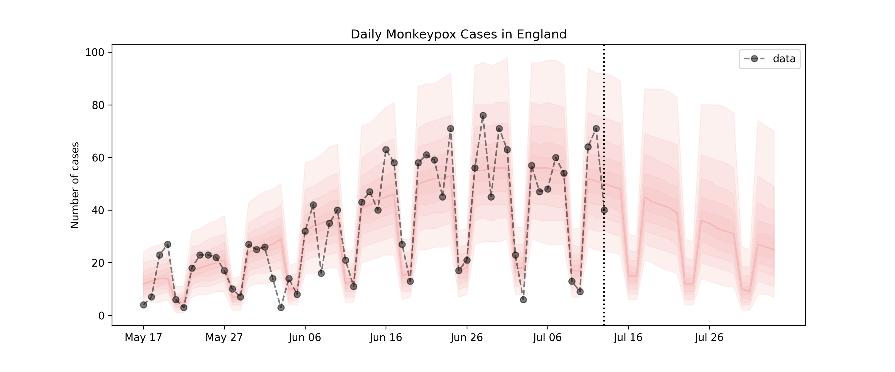

# Monkeypox Model

In my spare time I like to play around modelling stuff.

I've used numpyro to fit an epidemic model (Richard's growth curve)
to the daily Monkeypox cases reported in England.

I'm no expert in Epidemics. In fact, I know close to nothing.
You're free to use the material here for whatever you want, at your own risk.

